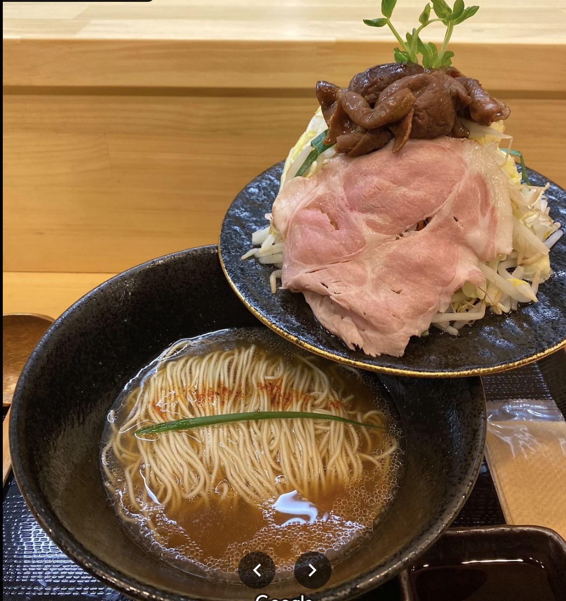

## Tokyo
### Azabudai
1. [Pizza](https://maps.app.goo.gl/GBWTfRGL9T8vr3QW8)

### Ginza
1. [Chicken Katsu](https://maps.app.goo.gl/QjRnVdr8tcxNX3zj7)

### Around Akihabara/ Ueno
1. [Duck Soba](https://maps.app.goo.gl/GhusjzWRrtRK66gk7)
2. [Gyukatsu, line is long, no reservation (ngon hơn Motomura)](https://maps.app.goo.gl/o8WkqDAJWxoncszs8)
3. [Oyakodon, come at opening, no reservation](https://maps.app.goo.gl/t9NvxpeSQbEFgM4D7)
4. [Tonkatsu](https://maps.app.goo.gl/25adquh5yY95GfhF7)
5. [Standing sushi](https://maps.app.goo.gl/PVnErzLaaByZpreV8)
6. [Inaka Soba](https://maps.app.goo.gl/AZbRDf3WcyB2VEHu7)
7. [Egg Sando & Pudding](https://maps.app.goo.gl/Uyz5Y7hZ4kPDXsoe6)
8. [Ramen light broth, with mountain of sprouts](https://maps.app.goo.gl/dGZDyxWLpjwgmGBE6)
	1. {:width="50%"  height="50%"}
9. [Chinese-inspired ramen](https://maps.app.goo.gl/mADTvjTzA2y6QVqc7)
10. [Omurice, no reservations, line up 15 - 30 mins before opening to get in for first/ 2nd seating](https://maps.app.goo.gl/8fFAZrXGRm9m8Zfw5)

### Asakusa
1. [The one and only Souffle pancake to try, must come 2.5hrs before opening (7:30AM) to wait and get a number to get the first seating at 10AM](https://maps.app.goo.gl/RA4bzNDr9egR2TWC6)

### Shinjuku
1. [udon, come before opening, install Line app, scan QR code to add yourself to waitlist](https://maps.app.goo.gl/HcDoBHbh2vrYETtU8)
2. [Seawood soup Tsukemen](https://maps.app.goo.gl/nCnTBtuu4cjWf4tM9)
3. [Michellin Shave ice, must try french toast, reservations released every night at 9PM 7 days in advance](https://maps.app.goo.gl/Nk48RBGGkb8fxrpEA)
4. [Nagasaki Soft serve, similar to Indigo Cow, very small kiosk with a bench on the side](https://maps.app.goo.gl/tiqL2jbsfkPWj2hp9)
5. [Yakiniku, reserve in advance](https://maps.app.goo.gl/x1um6voZAfS9e9Gt7)
 
### Shibuya
1. [3 course Hamburger with rice, reserve in advance](https://maps.app.goo.gl/5o5KXajs6521qd6z6)
2. [Michelin Tempura, reserve in advance](https://maps.app.goo.gl/1jUyQUmxo81JsnLZA)

## Kyoto
### Pontocho Alley
1. [Organ hotpot](https://maps.app.goo.gl/J4TC5Fhzw3JLWLzt5)
2. [Obanzai, English-speaking chef](https://maps.app.goo.gl/h5kKfUCy51Yt6jJt8)

### Kawaramachi
1. [Onigiri](https://maps.app.goo.gl/oWmLdUH1ieupBTJp9)
2. [Yakiniku, well rounded, delicious mushroom, friendly, english-speaking service, call to get reservation](https://maps.app.goo.gl/xxiq5B7ipDv1dS9A7)
3. [Meat sushi & Shaved Ice](https://maps.app.goo.gl/BzFsAUXtygE2A5W8A)A
4. [Omi Beef Yakiniku, meat a little bit sweeter](https://maps.app.goo.gl/H3MS1XDjJKPbXq6G8)

### Gion
1. [Fruit Daifuku, Dorayaki](https://maps.app.goo.gl/xFcGSDEMk9fktPuS7)

## Osaka
### Dotonbori
1. [Okonomiyaki, with simple art by request](https://maps.app.goo.gl/zjW6NZiUArFe95r98)
2. [Unagi don](https://maps.app.goo.gl/mY4TkEC5EuRUkjbFA)
3. [Sushi, good value](https://maps.app.goo.gl/mhURWdFG4CdZh2Ma6)
4. [Cheap, hearty, Beef fat udon, entrance hidden on the second floor of the apartment building](https://maps.app.goo.gl/NEvvRPYt5SF5FEhS9)
5. [Fried rice](https://maps.app.goo.gl/ajLR2tRYSQdQjNeq5)
 
 
### Additional Research
- Yakiniku [https://thepursuitoffoodperfection.wordpress.com/2019/11/04/best-yakiniku-in-tokyo-japan/](https://thepursuitoffoodperfection.wordpress.com/2019/11/04/best-yakiniku-in-tokyo-japan/)
- Offal/ organ meat: [https://gurunavi.com/en/japanfoodie/2017/11/horumon-a-tourists-guide-to-japans-mottainai-cuisine.html?__ngt__=TT14c9d89ca002ac1e4aed53sO6zedDF61Z53BIK0jmcQM](https://gurunavi.com/en/japanfoodie/2017/11/horumon-a-tourists-guide-to-japans-mottainai-cuisine.html?__ngt__=TT14c9d89ca002ac1e4aed53sO6zedDF61Z53BIK0jmcQM)
- [https://www.reddit.com/r/finedining/comments/16g9f83/got_a_few_reservations_in_tokyo_what_am_i_missing/](https://www.reddit.com/r/finedining/comments/16g9f83/got_a_few_reservations_in_tokyo_what_am_i_missing/)